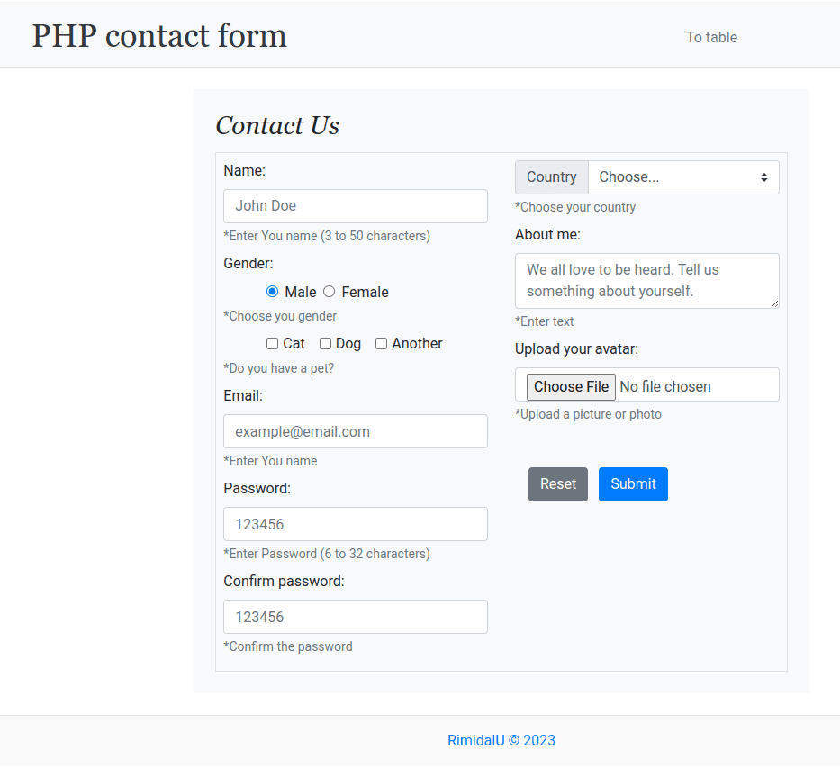
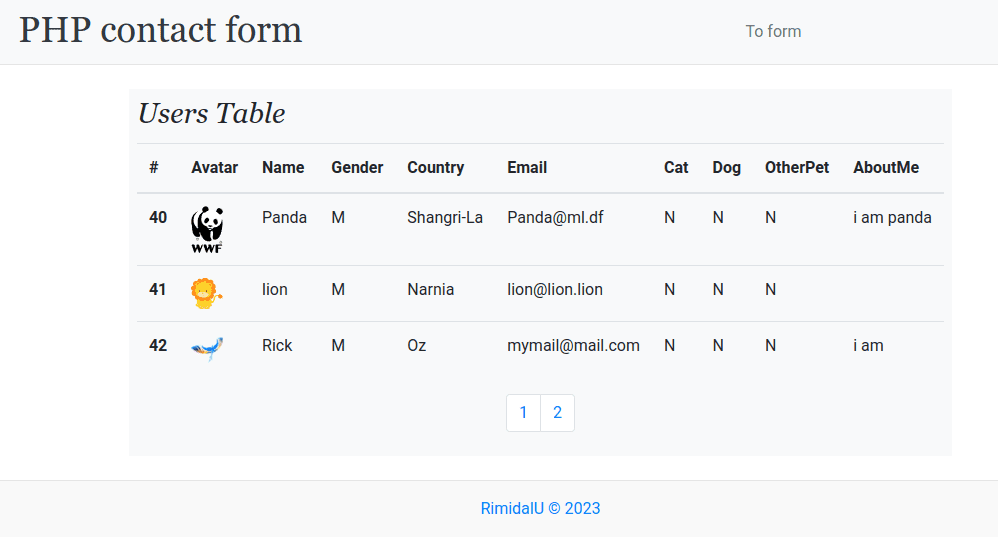

# Contact-form in PHP and MySQL.

> Two training pages with forms, database and tables.

---

[Description](#description) •
[Project setup](#project-setup) •
[Features](#features) •
[How To Use](#how-to-use) •
[Project Status](#project-status) •
[Room for Improvement](#room-for-improvement) •
[License](#license) •
[Contact](#contact)

## Description

 PHP. A form that adds to the database with notification of messages by e-mail + a table that displays all messages in the database with pagination.

## Project setup

- Clone this repo to your desktop.
- Сonfigure phpmailer and administration tool for MySQL according to his instructions.
- enter your values according to the sample .env.example file
- run createrDB.php and createrTableInDB.php to create tabl in you db
- open index.php on webserver.

## Features
- Vanilla php.
- Sending email with PHPMailer.
- Bootstrap layout.
- Work with form elements (validation and loading into the database).
- Loading and displaying a user avatar.
- Mapping data from database to table. Pagination.

## How To Use

Run [Live Demo](http://php-contact-form.epizy.com/)

<!-- ![tutorial][tutorial] -->

## Project Status

Project is: *in progress*

## Room for Improvement

To do:
- [X] fix layout,
- [ ] add tutorial,

Improvement:
- [ ] select count rows on the page during pagination,

## License

This project is open source and available under the [MIT](../LICENSE).

## Contact
Created by [@RimidalU](https://www.linkedin.com/in/uladzimir-stankevich/) - feel free to contact me!

<!-- MARKDOWN LINKS & IMAGES -->
<!-- [tutorial]: ./assets/screencast.webp -->
[screenshot]: ./assets/index.png
[screenshot2]: ./assets/table.png
